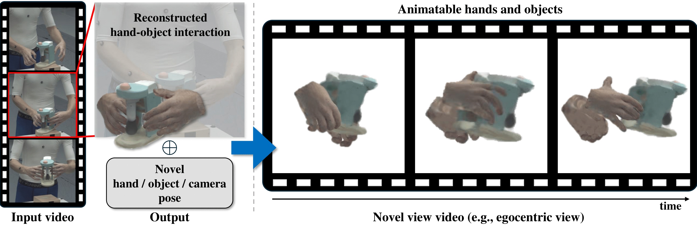

<h2 align="center"> 
  BIGS: Bimanual Category-agnostic Interaction Reconstruction from Monocular Videos via 3D Gaussian Splatting (CVPR, 2025)
</h2>

<h4 align="center">
  <a href="https://sites.google.com/view/jeongwanon">Jeongwan On</a>, <a href="https://khgwak.github.io/about/">Kyeonghwan Gwak</a>, Gunyoung Kang, <a href="https://junukcha.github.io/about/">Junuk Cha</a>,

  <a href="https://github.com/coding-Hwang">Soohyun Hwang</a>, Hyein Hwang , <a href="https://sites.google.com/site/bsrvision00/">Seungryul Baek</a>
</h4>

<h5 align="center">
  [Paper]
  [<a href="https://github.com/On-JungWoan/BIGS">Project Page</a>]
</h5>

<br>

<p float="center">
  
</p>

## Abstract

> Reconstructing 3Ds of hand-object interaction (HOI) is a fundamental problem that can find numerous applications. Despite recent advances, there is no comprehensive pipeline yet for bimanual class-agnostic interaction reconstruction from a monocular RGB video, where two hands and an unknown object are interacting with each other. Previous works tackled the limited hand-object interaction case, where object templates are pre-known or only one hand is involved in the interaction. The bimanual interaction reconstruction exhibits severe occlusions introduced by complex interactions between two hands and an object. To solve this, we  first introduce BIGS (Bimanual Interaction 3D Gaussian Splatting), a method that reconstructs 3D Gaussians of hands and an unknown object from a monocular video. To robustly obtain object Gaussians avoiding severe occlusions, we leverage prior knowledge of pre-trained diffusion model with score distillation sampling (SDS) loss, to reconstruct unseen object parts. For hand Gaussians, we exploit the 3D priors of hand model (i.e., MANO) and share a single Gaussian for two hands to effectively accumulate hand 3D information, given limited views. To further consider the 3D alignment between hands and objects, we include the interacting-subjects optimization step during Gaussian optimization. Our method achieves the state-of-the-art accuracy on two challenging datasets, in terms of 3D hand pose estimation (MPJPE), 3D object reconstruction (CDh, CDo, F10), and rendering quality (PSNR, SSIM, LPIPS), respectively.

<br>

## News

- 2025.02.27: 🎉 Paper accepted by CVPR 2025.

- 2024.09.30: 🏆 We gave an oral presentation at the HANDS Workshop, ECCV 2024.

- 2024.09.30: 🥇 We won the 1st place in Bimanual category-agnostic interaction reconstruction challenge in conjunction with ECCV 2024. [[Technical Report](https://hands-workshop.org/files/2024/UVHANDS.pdf)]

<br>

## Getting Started

```
TBD
```
